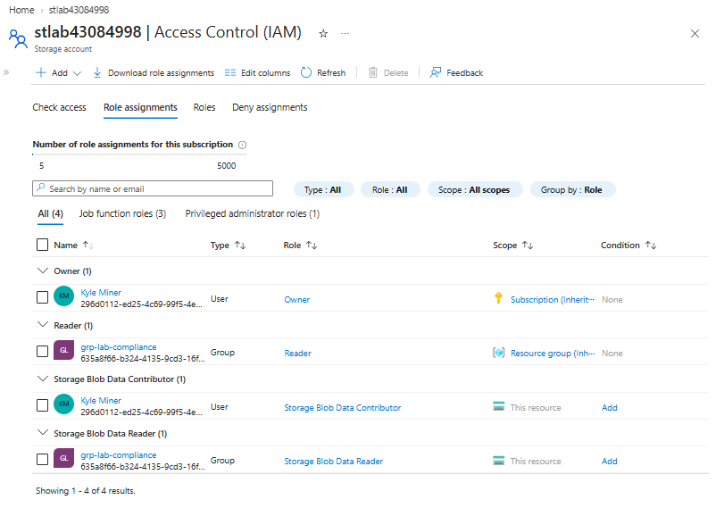
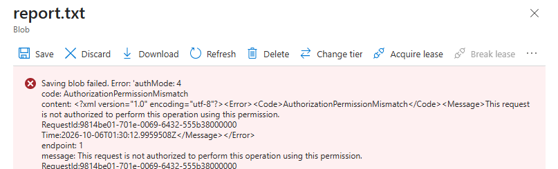
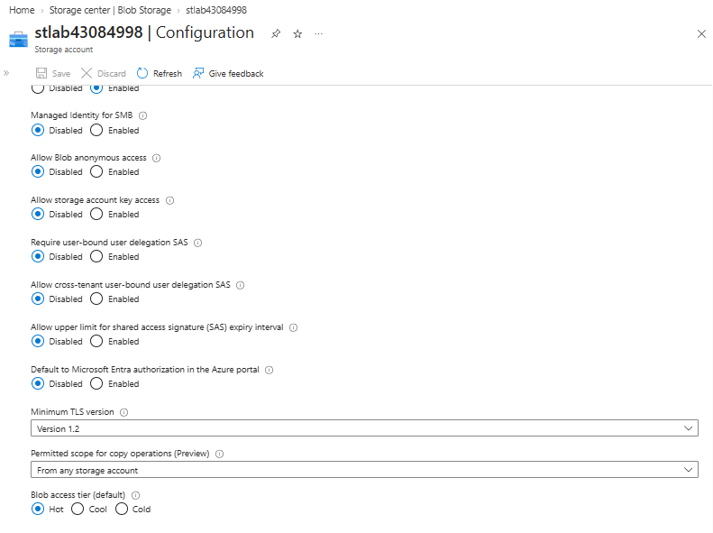
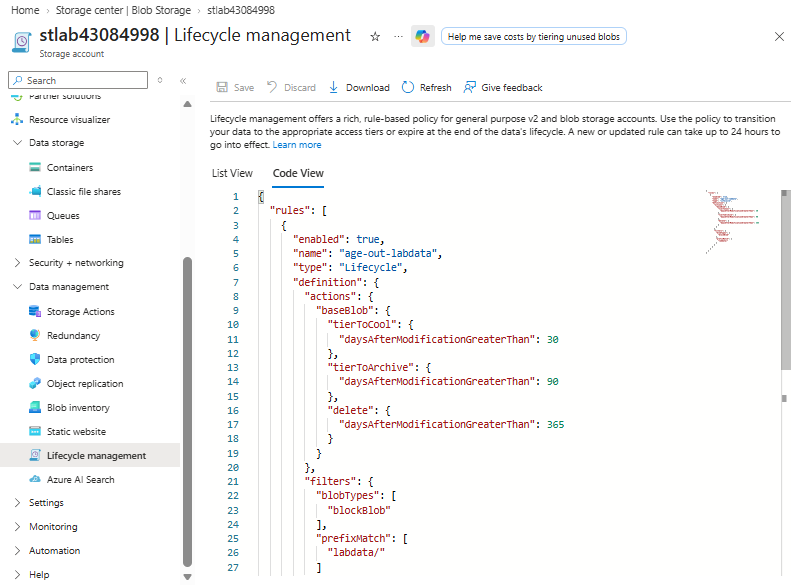
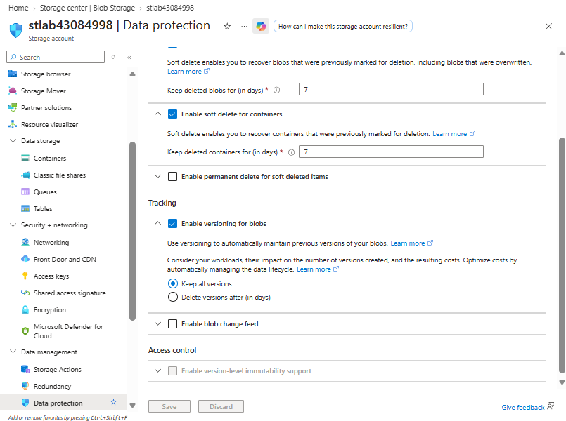
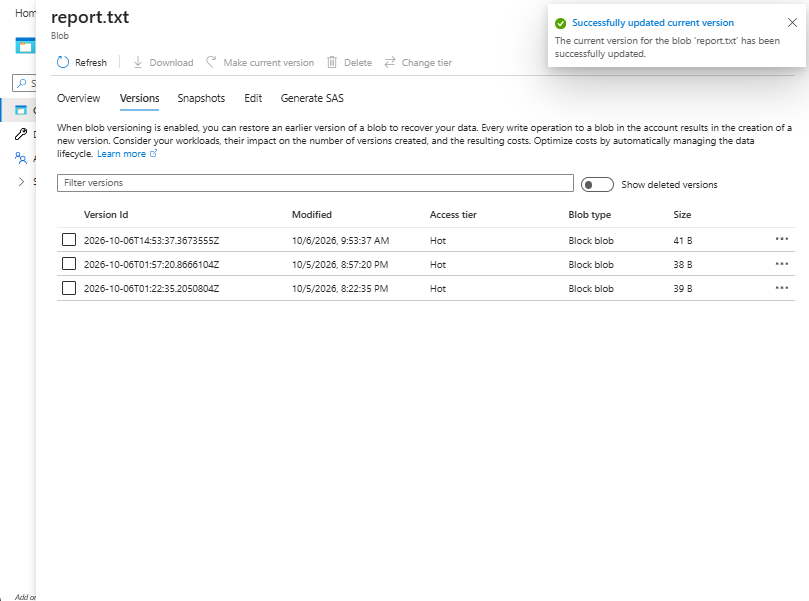
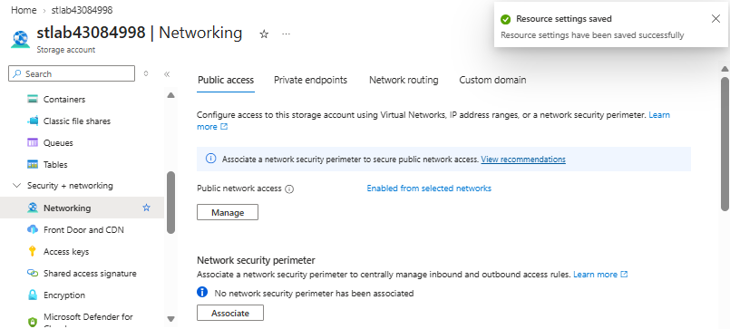
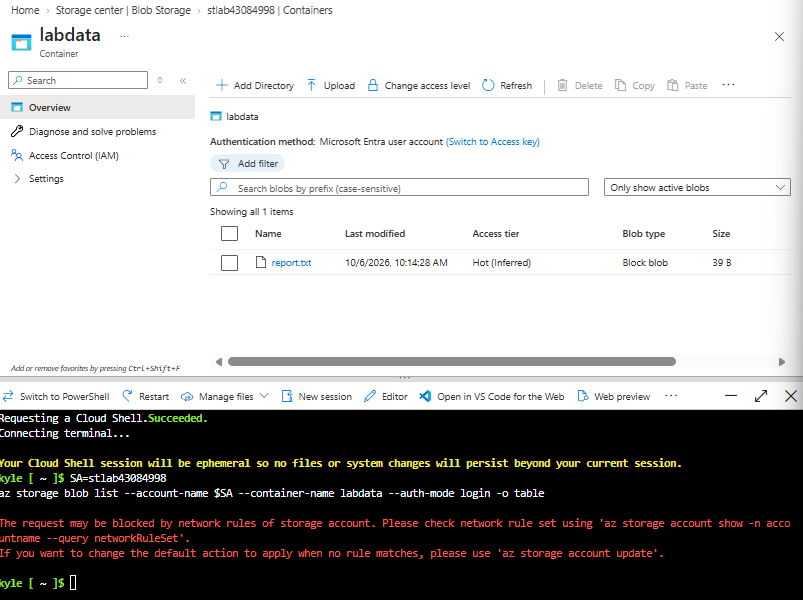

# Azure Secure Blob Storage

## Overview

This project demonstrates how I configured and validated a secure Azure Blob Storage environment using Microsoft Entra ID, Azure RBAC, lifecycle management, data-protection features, and storage firewall rules.

The goal was to create a storage design that:

- avoids anonymous and Shared Key access
- separates management-plane and data-plane permissions
- gives compliance users read-only blob access
- protects blobs from accidental deletion or overwrite
- automatically moves aging data to lower-cost storage tiers
- limits storage access by network source

---

## Architecture

```text
Microsoft Entra ID
        |
        +-- grp-lab-compliance
        |      |
        |      +-- Reader
        |      +-- Storage Blob Data Reader
        |
Azure Subscription
        |
rg-storage-lab
        |
stlab43084998
        |
        +-- Blob container: labdata
        |      |
        |      +-- report.txt
        |
        +-- Lifecycle policy
        +-- Soft delete
        +-- Blob versioning
        +-- Storage firewall
```

---

## 1. Identity and Data-Plane RBAC

The compliance group was granted two different types of access:

- **Reader** at the resource-group level for Azure resource visibility
- **Storage Blob Data Reader** at the storage-account level for read-only blob access

This demonstrates the difference between Azure management-plane permissions and Storage data-plane permissions.



The auditor account could access blob data but was unable to modify it because no write-capable Storage data role was assigned.



<details>
<summary>Additional RBAC context</summary>

The lab demonstrated that resource-level Reader permissions alone do not provide access to blob contents when using Microsoft Entra authentication.

Storage data access requires a separate Storage data role such as **Storage Blob Data Reader** or **Storage Blob Data Contributor**.

</details>

---

## 2. Secure Storage Baseline

The storage account was configured with a hardened access baseline:

- Blob anonymous access disabled
- Shared Key authorization disabled
- Minimum TLS version set to TLS 1.2

Disabling Shared Key access moves authentication toward Microsoft Entra ID and Azure RBAC instead of relying on storage account keys.



---

## 3. Lifecycle Management

A lifecycle rule named `age-out-labdata` was applied to the `labdata/` prefix.

The rule automatically manages aging block blobs:

| Blob age | Action |
|---|---|
| 30 days | Move to Cool tier |
| 90 days | Move to Archive tier |
| 365 days | Delete |

This allows older data to move automatically to lower-cost storage tiers without manual administration.



---

## 4. Data Protection and Recovery

Blob data protection was configured with:

- blob soft delete
- container soft delete
- blob versioning

These features help protect against accidental deletion and unwanted changes.



I validated version recovery by restoring a previous version of `report.txt`.



This demonstrated that versioning was not only enabled, but could also be used to recover earlier data.

---

## 5. Network Isolation

Public network access was restricted to selected networks rather than allowing traffic from all networks.



I then validated the firewall behavior from different access locations.

The approved client could access the blob, while Azure Cloud Shell was rejected by the storage network rules.



This demonstrates that network access controls operate separately from authentication and RBAC permissions.

---

## Validation Summary

| Control | Validation |
|---|---|
| Group-based RBAC | Compliance group received read-only Storage data access |
| Least privilege | Auditor write operation denied |
| Shared Key protection | Storage account key authorization disabled |
| Anonymous access | Disabled |
| TLS | Minimum TLS 1.2 |
| Lifecycle management | 30/90/365-day lifecycle rule configured |
| Blob recovery | Previous blob version restored successfully |
| Soft delete | Enabled for blobs and containers |
| Network restrictions | Cloud Shell blocked while approved client remained accessible |

---

## Troubleshooting

### Management Plane vs. Data Plane

One of the key lessons from this lab was that Azure resource permissions and Storage data permissions are separate.

A user can have permission to view a storage account in Azure Resource Manager without having permission to read the blobs stored inside it.

The compliance group therefore required both:

- **Reader** for management-plane visibility
- **Storage Blob Data Reader** for blob-data access

### Network Rules vs. Authorization

The lab also demonstrated that successful authentication does not guarantee access.

Even when an identity has valid RBAC permissions, the storage firewall can still reject the request if it originates from an unapproved network location.

This was validated when the approved client could access `report.txt`, while Azure Cloud Shell was blocked.

---

## Key Lessons

This project reinforced several AZ-104 concepts:

- Azure management-plane roles and Storage data-plane roles control different permissions.
- A user can see a storage account without necessarily being able to access its blobs.
- Storage network rules can deny a request even when the identity is otherwise authorized.
- Blob versioning and soft delete provide complementary recovery mechanisms.
- Lifecycle management can automatically reduce storage costs as data ages.
- Microsoft Entra authentication and Azure RBAC provide an identity-based alternative to storage account keys.
- Security controls should be validated with both successful and failed access tests.

---

## Scope and Limitations

This was a portfolio lab rather than a production deployment.

The project focused on Blob Storage security and administration. It did not implement:

- Private Endpoint architecture
- customer-managed encryption keys
- Azure Policy enforcement for Storage
- diagnostic logging to Log Analytics
- production-scale backup requirements
- Infrastructure as Code deployment

These would be appropriate extensions for a production environment.

---

## Cleanup

After validation, the lab resource group was removed to avoid unnecessary Azure charges.

---

## Repository Structure

```text
azure-secure-blob-storage/
├── README.md
└── screenshots/
    ├── blob-rbac-role-assignments.png
    ├── auditor-write-denied.png
    ├── storage-security-baseline.png
    ├── lifecycle-policy.png
    ├── data-protection-settings.png
    ├── blob-version-restored.png
    ├── storage-firewall-selected-networks.png
    └── firewall-validation.png
```

---

## Skills Demonstrated

- Azure Blob Storage
- Microsoft Entra ID
- Azure RBAC
- Storage Blob Data Reader
- Storage Blob Data Contributor
- Management plane vs. data plane
- Blob lifecycle management
- Blob versioning
- Soft delete
- Storage firewall rules
- Network-based access restrictions
- Least-privilege access design
- Azure Portal
- Azure CLI
